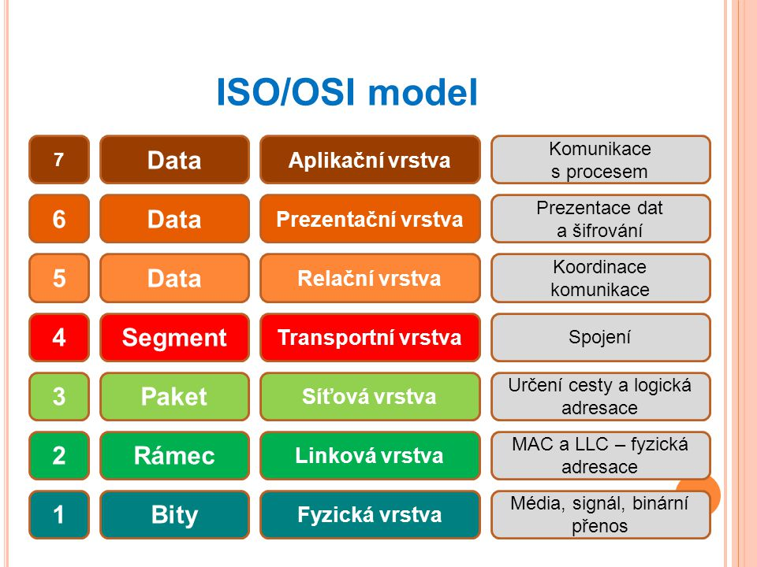
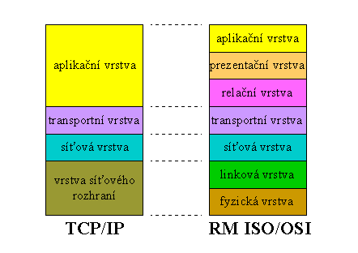

# 11. Sítě

## Ethernet

**Ethernet** je název souhrnu technologií pro počítačové sítě (LAN, MAN) z větší části
standardizovaných jako IEEE 802.3, které používají kabely s kroucenou dvoulinkou, optické kabely (ve
starších verzích i koaxiální kabely) pro komunikaci přenosovými rychlostmi od 1 Mbit/s po 100 Gbit/s.
Sítě Ethernet realizují fyzickou a linkovou vrstvu referenčního modelu OSI, takže je možné po nich
provozovat jeden nebo více protokolů síťové vrstvy, například AppleTalk, DECnet, IPX/SPX, a především
protokoly IPv4 a IPv6, které se používají pro služby sítě Internet.


Ještě před rokem 2000 se Ethernet stal dominantní technologií pro drátové nebo kabelové lokální sítě a
prakticky synonymem pro lokální síť (LAN). Používá se nejen pro propojování počítačů, ale i pro datová
úložiště, zařízení spotřební elektroniky jako jsou televizní přijímače a herní konzole a také jako drátové
rozhraní pro přístupové body WiFi a zařízení pro přístup k Internetu. Pokud zařízení deklaruje, že má
připojení na LAN, v naprosté většině případů to znamená, že je vybaveno konektorem 8P8C (RJ-45) pro
síť Ethernet s rychlostí 100 nebo 1000 Mbit/s.


## LAN
Označuje všechny malé sítě, které si mohou vytvořit i samotní uživatelé, 
jedná se o sítě uvnitř místností, budov a menších areálů. 
Poskytují přenosovou rychlost až desítek Gb/s. Skládá se z aktivních 
a pasivních prvků a slouží ke sdílení prostředků které jsou LAN dostupné. 
Pro spojení sítí typu LAN se využívají sítě typu WAN.

## Topologie
### Star
Tato topologie je nejpoužívanější způsob připojení počítačů do počítačové sítě. Každé koncové zařízení je pomocí kabelu připojené k centrálnímu prvku, 
switch nebo HUB, mezi dvěma zařízeními tedy existuje jen jedna cesta. Výhodou této 
topologie je že pokud selže připojení pro jedno zařízení tak to nijak neovlivní provoz na zbytku 
sítě a nedochází tak často ke kolizím. Nevýhodou je že je o něco dražší než např. 
topologie BUS a pokud selže centrální prvek dojde k selhání celé sítě.

### Bus
Spojení v této topologii zajišťuje jediné přenosové médium, ke kterému jsou připojeny všechna koncová zařízení. 
Je vhodná pro dočasné sítě díky tomu že je levná a snadná na realizaci. 
Nevýhodou je že pokud se ve stejný okamžik snaží vysílat dvě zařízení najednou 
tak vznikne kolize a také to že pokud selže přenosové médium tak selže celá síť.

### Ring
V této topologii je každé zařízení připojeno ke dvěma dalším tak že vytvoří kruh. 
V jednu chvíli vysílá pouze jedno zařízení a ostatní naslouchají, díky tomu tedy 
nedochází ke kolizím. Nevýhodou ale je že pokud selže jedno zařízení tak dojde k selhání celé sítě.

## Přenosová média

### Měděné dráty
Nejčastěji používané přenosové médium je kabel tvořený z kroucených dvoulinek, 
ty jsou tvořené páry vodičů, které jsou po celé délce pravidelně krouceny a následně jsou zkrouceny 
i vytvořené páry. V tomto typu přenosových médií jsou data přenášena pomocí elektrických impulzů. 
Šířka pásma až 10Gb/s.

### Optické kabely
Jsou tvořené z optických vláken, data jsou přenášeny pomocí světla díky čemuž může 
dosahovat velmi vysoké šířky pásma. Jsou odolné vůči elektromagnetickému rušení a 
umožňují přenos dat na velké vzdálenosti.

## Aktivní prvky

### Switch
Aktivní prvek, který propojuje jednotlivé prvky do star topologie, 
přeposílá síťový provoz jen tam kam je to potřeba na rozdíl od HUBu. 
Nejčastěji se používá v síti typu Ethernet realizované pomocí kroucených dvoulinek. 
Pracuje na druhé vrstvě ISO/OSI modelu, ale existují i switche které pracují na třetí vrstvě.

### Router
Používá se ke spojení alespoň dvou sítí a směrování provozu mezi nimi. 
Směrování probíhá na třetí vrstvě modelu ISO/OSI, používá směrovací tabulku, 
ve které se nachází cesty do jiných sítí a metriky spojené s těmito cestami.

### HUB
Může být základem sítě topologie star, kdykoliv mu přijdou data na jeden z 
portů tak je rozešle na všechny ostatní porty bez ohledu na to, kdo je 
příjemcem, kvůli tomu všechny koncové zařízení, jež jsou k němu připojena vidí 
veškerý provoz na síti. Pracuje na první vrstvě ISO/OSI modelu. 
Nyní se již moc nepoužívá, bývá nahrazen Switchem.

## Model ISO/OSI
Úlohou tohoto modelu je poskytnout základnu pro vypracování norem pro účely propojování systémů. 
Uvádí všeobecné principy sedmivrstvé architektury. Popisuje vrstvy, jejich funkce a služby. 
Každá z těchto vrstev vykonává skupinu jasně definovaných funkcí potřebných pro komunikaci, 
pro svou činnost využívá služeb své sousední nižší vrstvy své služby pak poskytuje sousední vyšší vrstvě.



## Model TCP/IP
Obsahuje sadu protokolů pro komunikaci v počítačové síti, množina pravidel, 
která určují syntaxi jednotlivých zpráv při komunikaci. Na rozdíl od modelu ISO/OSI 
má TCP/IP pouze čtyři vrstvy, kde každá vrstva využívá služeb sousední nižší vrstvy 
a poskytuje služby sousední vyšší vrstvě. Komunikace mezi stejnými vrstvami dvou 
různých systémů je řízena komunikačním protokolem za použití spojení vytvořeného sousední nižší vrstvou.



## MAC adresy

Jednoznačný identifikátor zařízení, který pracuje na druhé vrstvě modelu ISO/OSI. 
Je přiřazována již při výrobě zařízení, bývá označována jako fyzická adresa. 
Ethernetová MAC adresa se skládá ze 48bitů a zapisuje se jako šestice dvojciferných hexadecimálních čísel 
oddělených pomlčkami nebo dvojtečkami. Jsou přiděleny výrobcem a bylo předpokládáno 
že bude vždy celosvětově jedinečná. U moderních zařízení a síťových karet je možno MAC adresu změnit.

## IP adresy

### IPv4
IPv4 adresa 32bitová adresa a skládá se ze 4 oktetů, každý oktet obsahuje osm bitů, 
jednotlivé oktety jsou odděleny tečkou. Slouží k rozlišení jednotlivých rozhraní 
připojených k síti. Nejčastěji se používá IPv4, ale kvůli nedostatku adres se přechází na novější IPv6.

### IPv6
IPv6 adresy mají délku 128bitů a zapisují se pomocí hexadecimální soustavy. 
Každé čtyři bity jsou znázorněny hexadecimální hodnotou, každé čtyři 
hexadecimální hodnoty jsou odděleny dvojtečkou, neoficiálně označovány jako hextet.

## Podsítě
Menší vyčleněná část větší sítě, pro určení rozsahu IP adres slouží maska sítě. 
Maska sítě nám udává číslo sítě a broadcast adresu. To se dá zjistit z jakékoli IP 
adresy v daném rozsahu. Rozdělení na podsítě sníží celkovou zátěž sítě a zvýší její výkon. 
Ale také dá administrátorovi možnost lepšího zabezpečení, protože může říci které 
podsítě mohou navzájem komunikovat. Administrátoři také mohou seskupit zařízení 
do podsítě například podle patra budovy na kterém se nachází.

```
Autor: Tomáš Mrázek
Merger: Sádlík Kryštof
Datum: 10.5.2020
```