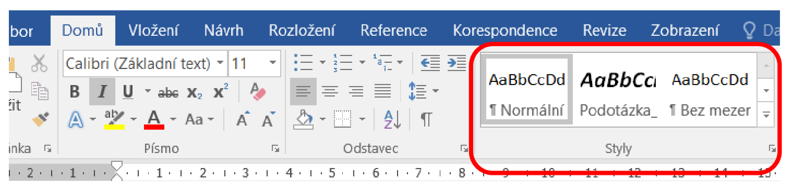

# 13. Tvorba dokumentů v balíku kancelářských aplikací

## MS Word

Microsoft Office Word je textový procesor od firmy Microsoft, který je součástí kancelářského balíku
Microsoft Office. Jeho první verzi vytvořil v roce _1983_ programátor Richard Brodie pro společnost IBM
(tato verze běžela pod operačním systémem DOS). Následovala mj. verze pro Macintosh (1984) a roku
1989 byl vytvořen první Word běžící pod OS Microsoft Windows.

### Prostředí


### Styly a formátování

Proč používat styly?

Jednoduchá, rychlá a efektní změna napsaného dokumentu. Pokud správně přiřadíme jednotlivým
částem dokumentu styly. Jednoduchou změnou formátování stylu změníme celý dokument. Navíc
tento dokument bude mít jednotnou formu. Udržíme si v něm přehled a celkový vzhled dokumentu
nabude profesionálního dojmu. Hodí se pro grafickou úpravu diplomovou práci či seminárky.

Před začátkem psaní však musíme vědět alespoň kostru. Jak by měl dokument vypadat, co bude nadpis,
co odstavec, co popis obrázků... Poté jednoduše přiřadíme příslušným textům daný formát, Nadpis1,
Normální atd...


### Nadpisy

Aby se mohl generovat obsah, je nezbytné mít veškeré nadpisy naformátovány některým z
vestavěných stylů. Na toto je dobré myslet již v okamžiku, kdy začínáme vytvářet dokument, nicméně
je možné toto provést i dodatečným naformátováním.

MS Word obsahuje předdefinovaný styly – nemusí se nastavovat, základ je připravený, Word nabízí
několik předdefinovaných stylů.

### Nastavení stylů:

V případě, že nadpis teprve vytváříte, vyberte před jeho napsáním styl nadpisu na kartě **_Domů_** v
podskupině **_Styly_** , otevřete podokno **_Styly_** , v podokně **_Styly_** vyberete požadovaný styl z galerie stylů.
Odstavce, které jste neformátovali, jsou naformátovány podle stylu Normální.



### Přiřazování stylů

V případě, že jste předem nenadefinovali styl, lze styl přiřadit. Označíte text, kterému chcete přiřadit
styl (vhodně jej naformátovat). Z pásu karet **_Domů_** v sekci **_Styly_** klikem na jméno stylu označenému
textu přiřadíte styl.

### Úprava stylu nadpisu

Pro úpravu stylu nadpisu si najdete na kartě **_Domů_** v sekci **_Styly_** požadovaný styl a kliknete na něho
pravým tlačítkem myši. Zvolte volbu změnit, zobrazí se vám následující tabulka:

V základní úpravě stylu můžete změnit název stylu, velikost písma, tloušťku, nastavit kurzívu, typ písma,
zarovnání, odřádkování, umístění apod. Pro pokročilejší formátování písma klinete na tlačítko a
vyberete, co chcete formátovat.


### Odstavce

V kartě **_domů_** v sekci **_Odstavec_** lze:

- vytvořit seznam s odrážkami, čísly či víceúrovňový seznam
- zarovnat text doleva, uprostřed, doprava či do bloku
- nastavit řádkování a vzdálenost odstavců
- stínovat (umožňuje změnit barvu za textem, odstavcem nebo buňkou tabulky)
- ohraničovat
- seřazovat (umožňuje uspořádat aktuální výběr podle abecedy nebo číselného pořadí)
- zobrazit vše (zobrazit skryté znaky jako jsou značky odstavců)

### Nastavení odstavce

Umožňuje vyladit rozložení aktuálního odstavce, včetně mezer, odsazení, atd.


### Funkce tabulátorů

Pokud potřebujete v dokumentu zarovnat
začátky textů ve sloupcích přesně na
centimetry, můžete si usnadnit práci
nastavením tabulátorových zarážek. Lze
nastavit i více zarážek v jednom řádku.

Po nastavení se pomocí klávesy Tab (na
klávesnici) přesouváte v řádku přesně na místa,
kde potřebujete začít psát. Na konci řádku
zmáčknete ENTER a toto nastavení se
automaticky nastaví i na další odstavec.

Tabulátor lze nastavit v kartě **_Domů_** v sekci **_Odstavec_** , poté **_nastavení odstavce_** a kliknete v tabulce na
**_Tabulátory_**.


### Generování a aktualizace obsahu

Generování obsahu se tvoří následujícím způsobem:

Umístíte kurzor na místo, kam chcete vložit vygenerovaný obsah. V kartě **_Reference_** kliknete na **_Obsah_** ,
zobrazí se předdefinované styly obsahu, můžete si zvolit jeden z nich či si vytvořit vlastní.

Tvorba vlastního obsahu:

V kartě **_Reference_** kliknete na **_Obsah_** a zvolíme variantu **_Vlastní obsah.._**


- Zobrazit čísla stránek - pokud toto „zatržítko“ deaktivujete, vygeneruje se obsah bez čísel
stránek. V praxi patrně není důvod tuto možnost vypínat
- Čísla stránek zarovnat doprava - ve výchozím nastavení jsou položky obsahu (nadpisy)
zarovnány doleva a čísla stránek vpravo, toto nastavení tedy doporučujeme, pokud byste chtěli
mít čísla stránek hned za položkami obsahu, můžete „zatržítko“ deaktivovat
- Vodící znak - aby čtenář lépe našel číslo stránky, odpovídající dané položce, jsou mezi položku
a číslo stránky vkládány tzv. "vodící znaky.", typicky jsou to tečky, ale můžete si vybrat i
pomlčky, podtržení, nebo nic.
- Zobrazit úrovně - pokud by byl obsah příliš dlouhý, můžete do něj zahrnout pouze nadpisy do
určité úrovně (typicky do Nadpisu 3), zde tedy vybíráte nejvyšší (respektive hierarchicky
nejnižší) úroveň nadpisu, který bude v obsahu uveden
- Namísto čísel stránek použít hypertextové odkazy - týká se pouze případu, kdy dokument
budete převádět do formátu www stránky (tedy do HTML), v takovém případě nebude obsah
obsahovat čísla, ale odkazy, pokud uživatel klikne na takový odkaz, prohlížeč přeskočí přímo
na příslušný nadpis v dokumentu
- Jak bude obsah vypadat, můžete sledovat v poli Náhled , kde se okamžitě promítají všechny
provedené změny v nastavení
- Možnosti – v záložce Možnosti si můžete nastavit nadpisy, které chcete v obsahu zobrazit a
jejich úrovně
- Změnit – v záložce Změnit můžete pořadí obsahu (Obsah1, Obsah2..) a jeho styl

Obsah vložíte do dokumentu stiskem tlačítka OK.

Aktualizace obsahu


Jestliže budete dokument dále upravovat, je nezbytné tyto změny promítnout i do obsahu, aktualizovat
obsah. To provedete jednoduše: nejprve kliknete jednou levým tlačítkem myši na již vytvořený obsah,
pak klepnete na totéž místo pravým tlačítkem a z kontextového menu vyberete Aktualizovat pole. V
následujícím dialogovém okně doporučujeme volbu **_Celá tabulka_** a následné potvrzeni OK.

Dalším způsobem, jak aktualizovat obsah je kliknutí na obsah levým tlačítkem a následně stisknout
klávesu F9.

Pracování s obsahem

K procházení dokumentu pomocí obsahu stačí kliknout na danou položku současně se stisknutou
klávesou Ctrl.

**V žádném případě nepřepisujte obsah vlastním textem!** Chcete-li upravovat jednotlivé položky, pak
měňte přímo příslušné nadpisy. Stejně tak změnu formátu obsahu provádějte výhradně při jeho
nastavování. Pokud budete provádět ruční zásahy, můžete o ně při následné aktualizaci přijít, nebo
naopak celý obsah „znefunkčníte“. Základní změny formátování písma jsou ale samozřejmě možné.

### Tvorba a úprava tabulky

Vytvořit tabulku ve Wordu můžete v kartě **_Vložení_** v sekci **_Tabulka_** , primárně si můžete nastavit počet
sloupců, řádků. Lze vytvořit i předdefinovanou tabulku, která se dá zvolit v sekci **_Tabulka,_** poté **_Rychlé
tabulky_**.

Když máte vytvořenou tabulku, můžete s ní dále pracovat. Kliknutím pravým tlačítkem myši na tabulku
a zvolíte "Vlastnosti tabulky". Můžeme určit její pozici, rozměry řádku, sloupce, (i každého zvlášť) a
samotné buňky. Dále lze kliknutím pravým tlačítkem myši sloučit, rozdělit a odstranit buňky. Vše
zmíněné lze změnit i v kartě **_Rozložení_** , která se zobrazí po kliknutí na tabulku.

Lze i převádět již napsaný text do tabulky, nebo naopak tabulku na obyčejný text. Obsah tabulky lze
také seřadit stejně jako v Excelu podle abecedy.

### Tvorba vzorců

### Vložení vzorce do buňky v tabulce


- V tabulce vyberte buňku, ve které se má zobrazit výsledek, pokud není buňka prázdná, vymažte
její obsah
- Na kartě Nástroje tabulky , Rozložení klikněte ve skupině Data na Vzorec
- V dialogovém okně Vzorec vytvořte vzorec (Můžete zadávat údaje do pole Vzorec , v seznamu
Formát čísla vybrat číselný formát a pomocí seznamů Vložit funkci a Vložit záložku vkládat
funkce a záložky.)


## MS Excel

### Popis prostředí


### Formátování tabulek

Excel nabízí mnoho předdefinovaných stylů tabulek, které můžete použít k rychlému formátování
tabulky. Pokud předdefinované styly tabulky nevyhovují vašim potřebám, můžete vytvořit vlastní styl
tabulky a použít ho. I když můžete odstranit jenom vlastní styly tabulky, můžete odebrat libovolný
předdefinovaný styl tabulky, aby se už nepoužil na tabulku.

Formátování tabulky můžete dále upravit výběrem možnosti rychlé styly pro prvky tabulky, jako jsou
**záhlaví** a **souhrny řádků** , **první** a **Poslední sloupec** , pruhované **řádky** a **sloupce** , a také **Automatické
Filtrování.**

### Volba stylu tabulky

Když máte oblast dat, která není formátovaná jako tabulka, Excel ji automaticky převede na tabulku,
když vyberete styl tabulky. Formát existující tabulky můžete změnit taky tak, že vyberete jiný formát.


- Vyberte libovolnou buňku v tabulce nebo oblast buněk, kterou chcete formátovat jako tabulku.
- Na kartě Domů klikněte na Formátovat jako tabulku.
- Klikněte na styl tabulky, který chcete použít.

### Podmíněné formátování

Podmíněné formátování můžete použít k vizuálnímu zkoumání a analýze dat, k rozpoznání zásadních
problémů a k identifikaci vzorů a trendů. Usnadňuje zvýraznění zajímavých buněk nebo oblastí buněk,
zdůraznění neobvyklých hodnot a vizualizaci dat pomocí datových pruhů, barevných škál a sad ikon,
které odpovídají specifickým variacím dat. Mění vzhled buněk na základě vámi určených podmínek.
Pokud jsou podmínky splněné, oblast buněk se naformátuje. Pokud podmínky splněné nejsou, formát
se nezmění. K dispozici máte spoustu předdefinovaných podmínek a můžete si taky vytvořit vlastní
(třeba se vzorcem, který podmínky vyhodnocuje jako pravdivé nebo nepravdivé).

Nastavení provedete na kartě **_Domů_** v sekci **_Styly_** ikona **_podmíněné formátování_** z menu **_Správa
pravidel_**. V dialogovém okně **_Nové pravidlo_** ... a v dalším zobrazeném dialogovém okně **_Určit buňky k
formátování pomocí vzorce._** Při použití podmíněného formátu za použití **_Určit buňky k formátování
pomocí vzorce_** je potřeba vyplnit:


- Pravidlo - které se bude kontrolovat, zda buňka obsahuje
- Formát - jak bude buňka vypadat, pokud bude pravidlo splněno
- Platí pro - ať nemusíte pro každou buňku vytvářet jednotlivě

### Relativní a absolutní adresování

**Absolutní adresa** je odkaz směřující stále na stejné buňky. Obsahují před označením řádku i sloupce
znak dolaru, např. $A$1.

**Relativní adresa** je odkaz přizpůsobující se nové pozici. Znak dolaru neobsahují, např. A1.

Pokud chcete provádět výpočty v tabulkách, musíte správně pochopit význam odkazů na buňky, které
se vyskytují ve vzorcích (na tyto buňky může být odkaz relativní nebo absolutní). Znak dolaru se nepíše
na klávesnici. Mezi jednotlivými typy adres přecházíme klávesou F4.

### Práce se vzorci


- Vzorce se zadávají do buňky stejně jako číslo nebo text
- Vzorec se zobrazuje v poli vzorců, kde se dá také jednoduše opravovat
- Vzorec musí začínat vždy znakem rovnítka
- Vzorec se tvoří na základě matematických zákonitost
- Excel zobrazuje v buňce jenom výsledek a v poli vzorců vzorec

### Úprava vzorce

Nejjednodušší způsob, jak upravit vzorec je opravovat ho přímo v poli vzorců. Nejdříve myší klikneme
na buňku, ke které se vzorec váže. Vzorec se zobrazí v poli vzorců, myší do něj klikneme a můžeme ho
upravovat. Po opravě vzorce stiskneme klávesu ENTER a opravený vzorec se uloží.


### Tvorba grafů

- Označíte datovou tabulku včetně prázdné buňky
- Klepnete na záložku karty VLOŽENÍ

- Ve skupině Grafy klepnete na tlačítko pro požadovaný typ grafu
- V zobrazené nabídce vyberete vhodný podtyp

Graf se vloží na list v podobě obrázku. Klepnutím do bílé plochy označíte celý graf, klepnutím na některý
prvek grafu označíte tento prvek. Po označení celého grafu jej můžete přesouvat pomocí myši a tahem
myší za pravý dolní roh grafu měnit jeho velikost.

Po klepnutí do grafu nebo na některý jeho prvek se zobrazí dvě nové karty: **_nástroje grafu – návrh_** a
**_nástroje grafu – formát._**

### Změna datové oblasti

Při přepisu tabulky se graf automaticky aktualizuje. Při přidání nového řádku nebo sloupce do tabulky
se však graf nezmění. Proto je třeba změnit definici datové oblasti grafu:


- Označíte graf.
- Na kartě nástroje grafu – návrh klepnete na tlačítko Vybrat data.
- V zobrazeném okně klepnete do položky Oblast dat grafu. Na listu vyznačíte novou oblast
datové tabulky.
- Potvrdíte tlačítkem OK.

Tlačítkem Zaměnit řádek za sloupec se prohodí řady a kategorie a datová tabulka v grafu přečte s
pootočením o 90°.

### Změna typu grafu

Typ vytvořeného grafu je možné dodatečně pozměnit:

- Označíte graf.
- Na kartě nástroje grafu – návrh klepnete na tlačítko Změnit typ grafu.
- V zobrazeném okně označíte nový typ a zvolíte vhodný podtyp.
- Klepnete na tlačítko OK.


### Typy grafů


- Sloupcový graf - jednotlivé hodnoty jsou vyznačeny barevnými sloupci. Obdobně funguje
pruhový graf, což je sloupcový graf pootočený o 90°, takže jednotlivé hodnoty tvoří vodorovné
barevné pruhy.
- Spojnicový (průběhový) graf - hodnoty jsou znázorněny body, spojenými lomenou čarou.
Tento typ grafu se nejčastěji používá pro znázornění průběhu na čase. Měsíce, roky atd. tvoří
popisky na ose kategorií.
- Bodový (X, Y) graf - znázorňuje závislost „něčeho na něčem“. Na ose kategorií jsou nezávislé
hodnoty, na ose hodnot závislé hodnoty. Zobrazené body lze proložit čárou nebo různými typy
křivek.
- Výsečový (koláčový) graf - zobrazuje rozdělení celku mezi jednotlivé části.


```
Autor: Svatava Malatinská
Merger: Sádlík Kryštof
Datum: 6.5.2020
```