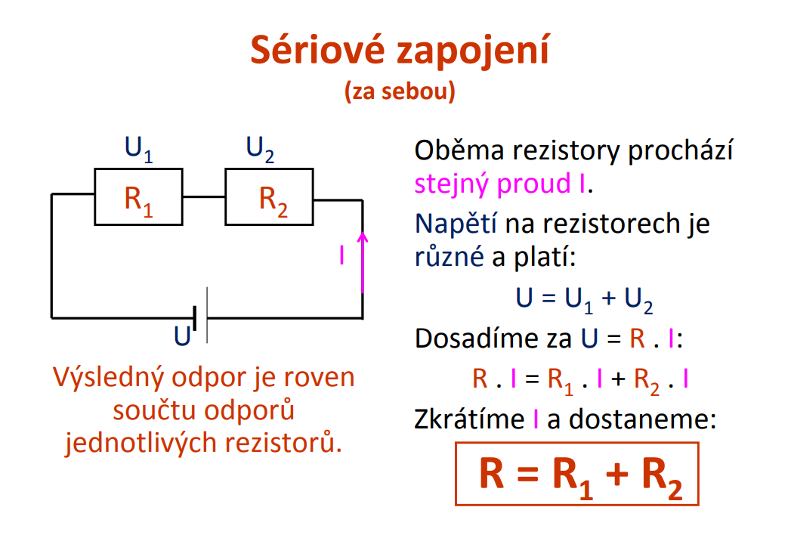
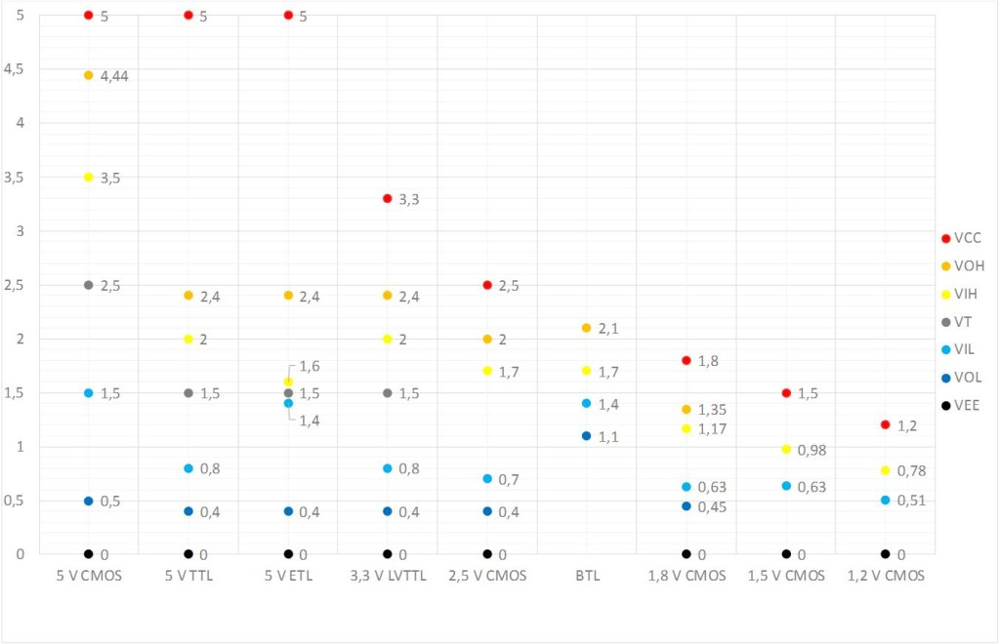

# 14. Základy elektroniky a Číslicová technika

## Základní eliktrické veličiny

### Elektrický náboj
	
Elektrický náboj je fyzikální veličina (skalární) popisující jednu ze 
základních vlastností hmoty a vyjadřuje velikost schopnosti působit 
elektrickou silou. Nositeli elementárního elektrického náboje jsou 
stavební částice hmoty - protony (kladný náboj) 
a elektrony (záporný náboj). Elementární náboj má velikost 
**e = 1,602·10-19 C (coulomb).** 
Celkový elektrický náboj je vždy celočíselným násobkem elementárního 
náboje, je tedy kvantován a roven algebraickému součtu elektrických 
nábojů jednotlivých částí. Elektrický náboj nelze vyrobit ani zničit, 
pouze přemístit (zákon zachování elektrického náboje). 
Těleso s elektrickým nábojem je zdrojem elektrického pole, 
ve kterém se projevuje působení elektrické síly. 

Jednotkou elektrického náboje v soustavě SI je coulomb (C). 
Je to takové množství elektrického náboje, který projde za 1 sekundu 
průřezem vodiče, jímž protéká ustálený proud 1 ampér (1 C = 1 A·s). 
Snadno lze vypočítat, že náboj 1 C odpovídá 6,242·1018 elementárních nábojů.

### Elektrický proud

Elektrický proud je uspořádaný pohyb volných částic s elektrickým nábojem, 
který nastává ve vhodném fyzikálním prostředí, vlivem elektrického pole. 
Jako fyzikální veličina je elektrický proud definován množstvím 
elektrického náboje Q prošlého soustavou za určitý čas t.
```
I= Q/t
```
Směr toku elektrického proudu je dán konvencí jako směr pohybu částic s kladným 
nábojem. V elektrických obvodech tedy proud teče od kladného pólu 
elektrického zdroje přes spotřebič k zápornému pólu zdroje. Tento směr je opačný 
ke směru pohybu volných elektronů v pevných vodičích. Elektrický proud 
stejnosměrný (direct current, DC, =) protéká obvodem jedním směrem, 
který se s časem nemění. Střídavý proud (alternating current, AC, ~) periodicky mění svůj 
směr i velikost.

Jednotka elektrického proudu – ampér (A) – je základní jednotkou SI. 
Je definován jako elektrický proud, který při stálém průtoku dvěma rovnoběžnými přímými 
nekonečně dlouhými vodiči zanedbatelného kruhového průřezu, umístěnými ve vakuu ve 
vzájemné vzdálenosti 1 metr, vyvolá mezi nimi stálou sílu o velikosti 2·10–7 newtonu 
na 1 metr délky vodiče.

### Elektrický odpor 
Elektrický odpor (rezistance) je fyzikální veličina charakterizující schopnost daného systému vést elektrický proud. Závisí na materiálu, teplotě, délce a průřezu vodiče. Každý materiál má charakteristický měrný odpor ρ (rezistivitu). 
S rostoucí délkou vodiče L roste jeho odpor R, s rostoucím průřezem vodiče A jeho odpor klesá.
```
R=(ró)*L/A
```

### Elektrické napětí

Elektrické napětí je definováno jako rozdíl elektrických potenciálů mezi dvěma body v elektrickém poli nebo jako 
práci vykonanou při přemístění kladného jednotkového elektrického náboje 
mezi dvěma body elektrického pole.

Jednotkou elektrického potenciálu a elektrického napětí je volt (V). 
Je to napětí mezi konci vodiče, do něhož stálý proud 1 ampéru 
dodává výkon 1 wattu.

## Elektrická práce a výkon elektrického proudu
Nejčastějším případem konání elektrické práce je působení elektrického pole 
zdroje o napětí U na částice s elektrickým nábojem ve vodiči, 
které způsobí pohyb částic – elektrický proud I po dobu t.

```
W = U*I*t
```

Elektrický výkon je fyzikální veličina, která vyjadřuje vykonanou elektrickou práci za jednotku času. 
Značí se písmenem P a jeho jednotkou je watt, značený písmenem W. 
Elektrický výkon je druhem výkonu, u kterého práci koná elektrická síla

```
P = U*I -> W=P*t (Ws, kWh)
```

Účinnost je fyzikální veličina, která udává poměr mezi výkonem a příkonem stroje při vykonávání práce.

Energie dodaná stroji musí být vždy větší než práce strojem vykonaná z důvodu ztrát - přeměně energie na 
neužitečné druhy (např. v důsledku tření se mění mechanická energie v teplo). 
Proto účinnost je vždy menší než 100 %.

```
η = P/P˘p
```

## Sériové a Paralelní zapojení resistorů 
### Sériové zapojení


### Paralelní zapojení


## Zdroje napětí
Zdroj napětí je v elektrotechnice takový zdroj, 
který na svém výstupu udržuje stálé elektrické napětí 
bez ohledu na elektrický proud. Ideální zdroj napětí neexistuje, 
protože vnitřní odpor reálného zdroje omezuje maximální proud, 
který může elektrickým obvodem protékat. 
Reálný elektrický zdroj může pro zajištění stabilního napětí na výstupu 
používat stabilizátor napětí, který zajišťuje pomocí úbytku napětí.

Podle vnitřního odporu lze rozdělit elektrické zdroje na **tvrdé a měkké**. 
Tvrdý zdroj má odpor menší než 1 Ω (např olověný akumulátor). 
Měkký zdroj má vnitřní odpor větší než 1 Ω. 

Reálné zdroje napětí: 
- Měnič napětí (AC adaptér, transformátor) 
- Chemické zdroje (primární článek = Voltvů článek, zinko-uhlíkový článek, sekundární článek = olověný akumulátor, alkalický akumulátor) 
- Mechanické zdroje (elektrický generátor – dynamo, alternátor) 
- Tepelné zdroje (termočlánek) 


## Základní logické funkce

Logická funkce je funkce, která pro konečný počet vstupních parametrů vrací 
logické hodnoty. Používá se v oboru teorie řízení a číslicové techniky, 
v praxi pak například v mikroprocesorové technice. 
Parametry logické funkce jsou logické proměnné. 

### AND
Logický součin – má na výstupu log. 1 pouze tehdy, je-li na všech jeho vstupech log. 1.
Matematický zápis: Y = A * B

 A | B | Y
--- | --- | ---
0 | 0 | 0
0 | 1 | 0
1 | 0 | 0
1 | 1 | 1

### NAND
Negovaný logický součin – má na výstupu log. 1 pouze tehdy, 
pokud není na všech vstupech log. 1. Je to negovaný (opačný) 
výsledek logického součinu (AND). Je to nejpoužívanější log. člen.
Matematický zápis: Y = /(A * B)

 A | B | Y
--- | --- | ---
0 | 0 | 1
0 | 1 | 1
1 | 0 | 1
1 | 1 | 0

### OR
Logický součet – má na výstupu log. 1 pouze tehdy, 
pokud je alespoň na jednom vstupu log. 1.
Matematický zápis: Y = A + B

 A | B | Y
--- | --- | ---
0 | 0 | 0
0 | 1 | 1
1 | 0 | 1
1 | 1 | 1

### NOR
Negovaný logický součet – má na výstupu log. 1 pouze tehdy, 
pokud je na všech vstupech log. 0. Je to negovaný (opačný) 
výsledek logického součtu (OR).
Matematický zápis: Y = /(A + B)

 A | B | Y
--- | --- | ---
0 | 0 | 1
0 | 1 | 0
1 | 0 | 0
1 | 1 | 0

### XOR
Exklusivní logický součet – má na výstupu log. 1 pouze tehdy, 
pokud je na vstupech rozdílná log. hodnota.
Matematický zápis: Y = /(A B)

 A | B | Y
--- | --- | ---
0 | 0 | 0
0 | 1 | 1
1 | 0 | 1
1 | 1 | 0

### NOT 
Logická negace (invertor) – na výstupu je vždy opačná logická 
hodnota než na vstupu.
Matematický zápis: Y = /A

### YES (repeater)
Opakovač – na výstupu je vždy stejná logická hodnota jako na vstupu.
Matematický zápis: Y = A


## Logické úrovně

Boolean -> True a False
Mezi těmito stavy, je zakázané pásmo (Zamezuje špatné registraci hodnoty)


### Vysvětlivky:
```
VOH     (Voltage Output High; minimální výstupní napětí pro logickou 1)
VCC     (kladné napájecí napětí integrovaného obvodu)
VOL     (Voltage Output Low; maximální výstupní napětí pro logickou 0)
VIH     (Voltage Input High; minimální vstupní napětí pro logickou 1)
VIH-max (maximální vstupní hodnota napětí pro logickou 1) 
VIL-min (minimální vstupní hodnota napětí pro logickou 0)
VIL     (Voltage Input Low; maximální vstupní hodnota napětí pro logickou 0)
VCC     (připojený kolektor tranzistoru – Collector)
VEE     (připojený emitor tranzistoru – Emitter) 
VDD     (kladné napájecí napětí; Drain)
VSS     (GND nebo záporné napájecí napětí; Source)

```

## Logické hodnoty
Logický, číslicový či digitální obvod je elektronický obvod, 
který pracuje s diskrétními stavy. Jsou tvořeny tzv. logickými členy 
(nazývanými též hradla). Naopak z logických obvodů se skládají 
číslicové systémy.

Na rozdíl od analogových elektronických obvodů, 
které jsou založené na spojité formě informace 
(mechanické ručičkové hodiny), v logických obvodech je 
informace reprezentována a zpracovávána v podobě diskrétní 
(digitální hodiny).

## Typické kombinační obvody 
- dekodéry
- multiplexery a demultiplexery
- komparátory
- obvody pro aritmetické operace (sčítačky, generátory přenosu apod.

## Přehled kódů používaných v čislicové technice
** Nemůžu najít informace -> Grayův kód **

## Pull-up/pull-down na vstupech čislicových obvodů
Co se ale stane v případě, že na vstup není přivedeno žádné napětí?

V praxi často vstupní logické obvody obsahují tzv. pull-up a pull-down rezistory. Ty nám určují, 
zda v takovém případě bude tato situace vyhodnocena tak, jako by byla hodnota přivedeného 
signálu logická 1 (pull-up) nebo logická 0 (pull-down). Pull-up znamená, 
že je na vstupu zapojen odpor určité hodnoty připojen mezi vstup a kladné napájecí napětí, 
pull-down naopak značí připojení odporu k logické zemi (nejčastěji 0 V). V závislosti 
na typu integrovaného obvodu lze tyto odpory nastavovat programově.

## Připojení LED
Za úplně nejzákladnější znalost považuji zapojení LED diod a tlačítek. 
Na následujícím obrázku můžete vidět, že nejběžnější zapojení LED diody 
je přivedení anody na +5V a katody na výstup přes rezistor. Hodnota tohoto rezistoru 
se vypočítá dle vzorce na obrázku. Odpor [Ohm] je roven celkovému napětí 
(5V) [V] mínus napětí na diodě [V] lomeno proudem [A]. Zde bych rád upozornil, 
že ne vždy je hodnota odporu určená výpočtem vyhovující. Pokud potřebujete, aby dioda svítila méně, 
stačí použít odpor s vyšší hodnotou. To nejčastěji využijete u bílé a možná modré LED diody, 
jejichž svítivost je skutečně vysoká. Pokud neznáte parametry diody, kterou máte zrovna po ruce, 
nemělo by vadit ani použití nějakého odporu v rozmezí +/- 330R až 1k5 a u bílé klidně i 10k.


```
Autor: Jasim Sabry
Merger: Sádlík Kryštof
Datum: 10.5.2020
```