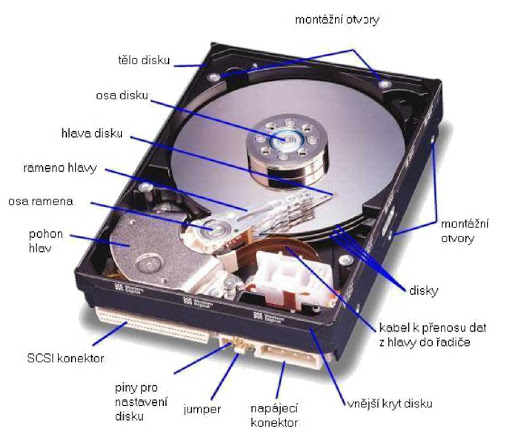

# 5. Boot OS a file systems

## MBR a boot sektor

Jakmile proběhne úspěšný test zavádění systému, POST, najde a zavede (vygeneruje se přerušení 19h)
se tzv. bootovací sektor (boot sektor) – tomuto procesu se říká bootování. Bootovací sektor je v tomto
případě oblast 512 bajtů na záznamovém médiu, které je jako první nastavené v paměti BIOSu – ESCD
(lze změnit v Setupu). Výrobce standardně nastavoval u starších PC jako první bootování z diskety,
poté z pevného disku a nakonec z CD mechaniky. U novějších jsou tyto možnosti nastavitelné. Dnes je
možné bootovat i pomocí sítě. Bootsektor se nachází na prvním sektoru záznamového média (v případě

```
Generace
SATA Standard
```
```
Datová
propustnost Frekvence
```
1. SATA 1,5 Gb/s 150 MB/s 1,5 GHz
2. SATA 3 Gb/s 300 MB/s 3 GHz
3. SATA 6 Gb/s 600 MB/s 6 GHz


pevných disků je to válec 0 hlava 0 stopa 0 sektor 1) nastaveného pomocí jumperů na HDD nebo v
Setupu jako primární. Pakliže BIOS hledá a nenajde, zastaví se a vypíše patřičné chybové hlášení.

BIOS se snaží najít na tomto sektoru Master Boot Record (MBR) – hlavní spouštěcí záznam. Ten
nahraje do paměti na adresu 0000:7C00 a v případě úspěchu mu předá řízení. Správnost MBR BIOS
zjišťuje pomocí kontrolní hodnoty umístěné na posledních dvou bajtech sektoru - AA55h (zápis je
uložen ve formátu little endian). V případě chybného MBR se bootovací proces přeruší pomocí
softwarového přerušení 18h, které vygeneruje chybové hlášení, jež může vypadat v případě starých
AMI BIOSů takto:

_NO ROM BASIC – SYSTEM HALTED_

Nebo u novějších známější:

_Non-System Disk or Disk Error_

MBR se skládá ze dvou částí – Partition Loaderu a Partition tabulky. MBR uchovává záznamy o
rozdělení disku (oddílech) a určuje, ze kterého z nich se má bootovat. Je-li MBR v pořádku, řízení se
předá Partition Loaderu. Ten v Partition tabulce vyhledá oddíl, který je označen jako aktivní a přejde na
první sektor tohoto oddílu. MBR sám sebe překopíruje na jiné místo v paměti a na své původní místo
zkopíruje tento první sektor a předá mu řízení (instalace více operačních systémů na jedno PC obyčejně
zahrnuje i nahrazení originálního loaderu bootovacím loaderem programu, který uživateli umožňuje
vybrat konkrétní disk pro další kroky procesu).

Tento boot sektor obsahuje Volume Boot Record (zkráceně VBR). Obsahuje v sobě kromě krátkého
programu také tabulku rozdělení svého oddílu, kde jsou uloženy tzv. rozšířené oddíly, které navíc
mohou obsahovat další oddíly označované jako logické jednotky. Kromě toho obsahuje další dodatečné
údaje o daném oddílu (počet bajtů na sektor, počet sektorů na cluster atp.). Úloha VBR je závislá na
konkrétním operačním systému, v drtivé většině případů však nejdříve kontroluje sám sebe (stejný
mechanismus jako u MBR) a poté vyhledá sektor, na kterém se nachází první ze souborů operačního
systému (obyčejně se mu říká zavaděč, například v MS-DOSu je to soubor IO.SYS, ve Windows
soubor NTLDR). Ten nahraje do paměti a tím tak zavolá zaváděcí program. Další procesy jsou
specifické pro daný operační systém.

Diskety a jednotky flash neobsahují MBR, ale VBR.

## Fáze bootování OS

Bootování je proces oživení počítače, kdy dochází k probuzení počítače, postupnému zavedení operačního systému,
inicializaci a konfiguraci technického vybavení počítače. Celý proces bootování má dvě fáze. První je zcela nezávislá na
instalovaném OS a je na dané architektuře zcela stejná. Začíná stiskem vypínače, po němž začne systémový program ROM
BIOS uložený ve vnitřní pevné paměti počítače vykonávat základní test hardwaru počítače POST. Zjištěné skutečnosti
porovnává se záznamy o základním nastavení počítače uloženými v paměti CMOS RAM. Program ROM BIOS potom
vyhledává a konfiguruje zařízení podporující technologii Plug&Play a nalezeným zařízením přidělí systémové prostředky.
Následuje test operační paměti. Dalším krokem je spuštění části systémového ROM BIOS nazvaného zavaděč (bootstrap
loader), který vyhledává na vnějších pamětech hlavní spouštěcí sektor (Master Boot Sector).. Druhá fáze bootování je
naopak na použitém OS závislá a tudíž nemusí být u různých OS totožná. Na počátku druhé fáze načte boot loader do


operační paměti příslušné jádro, tzv. kernel operačního systému a spustí jej. Dále se u OS s modulární strukturou zavádí celá
skupiny systémových součástí včetně grafického prostředí. Na konci celého procesu bootování je počítač připravený k práci,
tedy spustit některý uživatelský program nebo vykonávat jiné příkazy uživatele.

## Geometrie pevného disku


## Metody přístupu na disk

Čas přístupu na disk je dělen na tři části:

- SEEK - přesun hlavy na požadovanou stopu (cylindr),
- LATENCY - otočení disku na začátek požadovaného sektoru,
- TRANSFER - přesun dat z disku/na disk.

Při velkých zátěžích v OS s více procesy nejvíce zpomaluje přístup na disk čas SEEK.

Existuje několik metod plánování disku a je možná i jejich adaptivní kombinace v závislosti na zátěži. Při vyřizování
požadavku OS na disk je potřeba nejprve vystavit hlavy na příslušnou stopu a pak počkat, až bude požadovaný sektor pod
hlavami. U víceúlohových systémů mohou přicházet požadavky na disk rychleji, než je možné je vyřizovat.


### FCFS (First Come, First Served)

Vyřizování požadavků v pořadí, jak přicházejí (tzv. FIFO nebo FCFS - First In First Out, First Come First Serve) není
optimální a je vhodný pro lehké zátěže.

### SSTF (Shortest Seek Time First)

Naplánován je požadavek s nejmenším relativním pohybem hlavy. Existuje zde možnost, že nastane starvation.

### SCAN

Je určen směr pohybu hlav. Z fronty jsou zpracovávány pouze požadavky postupně v určeném směru. Po zpracování
nejkrajnějšího požadavku se směr pohybu hlav obrátí. Podvariantou je C-SCAN (Circular SCAN), který posouvá hlavy
pouze v jednom směru a po zpracování nejkrajnějšího požadavku přesune hlavy opět na začátek. Obě varianty jsou vhodné i
pro velmi těžké zátěže.

Poznamenejme, že moderní řadiče disků umí optimalizovat i požadavky pro přístup k disku v závislosti na poloze hlav a
natočení disku. Výsledkem je změna pořadí požadavků a zrychlení vykonání požadavků v celkovém součtu.

## Souborové systémy

### FAT32

FAT32 A version of the File Allocation Table (FAT) available in Windows 95 OSR 2 and Windows 98.
FAT32 increases the number of bits used to address clusters and also reduces the size of each cluster.
The result is that it can support larger disks (up to 2 terabytes) and better storage efficiency. FAT32 is
the older of the driven formats. FAT32 is the most common version of the FAT file system created back
in 1977 by Microsoft. FAT had been the standard format for floppy disks and hard drives.

### NTFS

NTFS stands for New Technology File System. It's the file system that the Windows NT operating
system uses for storing and retrieving files on a hard disk. NTFS offers a number of improvements in
terms of performance, extensibility, and security. Such as improved support for metadata and advanced
data structures to improve performance, reliability, and disk space use. This file system is supported in
other desktop and server operating systems as well. Linux and BSD have a free and open-source NTFS
driver, called NTFS-3G, with both read and write functionality. macOS comes with read-only support
for NTFS.

### Ext4

Ext4 stands for a Fourth extended file system. It is the evolution of the most used Linux filesystem,
Ext3. In many ways, Ext4 is a deeper improvement over Ext3 than Ext3 was over Ext2. Ext4 modifies
important data structures of the filesystem such as the ones destined to store the file data. The result is a
filesystem with an improved design, better performance, reliability, and features. Ext4 supports file-
based encryption. In a directory tree marked for encryption, file contents, filenames, and symbolic link
targets are all encrypted. Encryption keys are stored in the kernel keyring.


### FAT32 vs Ext4 vs NTFS

- FAT32 is the older. NTFS is the newer drive format. Ext4 is the newest of these drive formats.
- FAT32 originally designed in 1977. NTFS introduced in July 1993. And Ext4 stable version released
on 21 October 2008.
- FAT32 is read/write compatible with a majority of recent and recently obsolete operating systems,
including DOS, most flavors of Windows (up to and including 8), Mac OS X, and many flavors of
UNIX-descended operating systems, including Linux and FreeBSD.
- NTFS is fully read/write compatible with Windows from Windows NT 3.1 and Windows XP up to and
including Windows 8. Mac OS X 10.3 and beyond have NTFS read capabilities, but writing to an
NTFS volume requires a third party software utility like Paragon NTFS for Mac.
- Ext4 is one of the latest and greatest Linux file formats.
- Ext4 modifies important data structures of the filesystem such as the ones destined to store the file
data.
- The ext4 format allows users to still read the filesystem from other distributions/operating systems
without ext4 support.
- Ext3/4 is by far the best filesystem format, but it's not supported natively by Windows or Macs. A
good option is to create a small FAT32 partition and copy or install an application such as Ext2Fsd and
format the rest as ext4.
- ext4 has very large limits on file and partition sizes., allowing you to store files much larger than the 4
GB allowed by FAT32.
- Use Ext4 when you need a bigger file size and partition limits than FAT32 offers and when you need
more compatibility than NTFS offers.
- NTFS is ideal for internal drives, while Ext4 is generally ideal for flash drives.
- Ext4 filesystems are complete journaling filesystems and do not need defragmentation utilities to be
run on them like FAT32 and NTFS.
- The ext4 filesystem can support volumes with sizes up to 1 exbibyte (EiB) and files with sizes up to
16 tebibytes (TiB).
- The maximum possible size for a file on a FAT32 volume is 4 GiB.
- The design of the FAT32 file system does not include direct built-in support for long filenames.
- Ext4 is backward-compatible with ext3 and ext2, making it possible to mount ext3 and ext2 as ext4.
- Ext4 uses a performance technique called allocate-on-flush.
- Ext4 allows an unlimited number of subdirectories.


- The ext4 file system does not honor the "secure deletion" file attribute, which is supposed to cause
overwriting of files upon deletion.
- Windows uses hard links to support short (8.3) filenames in NTFS.
- NTFS is a journaling file system and uses the NTFS Log to record metadata changes to the volume. It
is a feature that FAT does not provide and critical for NTFS to ensure that its complex internal data
structures will remain consistent in case of system crashes or data moves performed by the
defragmentation API, and allow easy rollback of uncommitted changes to these critical data structures
when the volume is remounted.
- When it comes to file checking, EXT4 is quicker because unallocated blocks of data are marked as
such and are simply skipped during disk check operations.
- The Encrypting File System (EFS) provides the core file encryption technology used to store
encrypted files on NTFS volumes.
- FAT is a simple file system that is supported for reading and writes on all major operating systems
(which is why it's a good choice for external drives), it has no security and it does not perform well
with large files. NTFS makes improvements on FAT with security and in many cases contiguous reads,
but it still suffers some similar ailments. Ext is generally a good choice for working with most files,
however, small files would benefit more from contiguous allocation.
