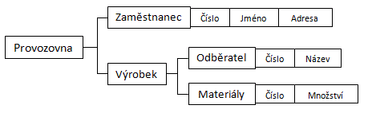

# 9. Databáze

## Databáze a systémy řízení báze dat
Databáze (neboli datová základna, též databanka) je systém souborů s pevnou strukturou záznamů. Tyto
soubory jsou mezi sebou navzájem propojeny pomocí klíčů. V širším smyslu jsou součástí databáze i
softwarové prostředky, které umožňují manipulaci s uloženými daty a přístup k nim. Tento software se v
české odborné literatuře nazývá systém řízení báze dat (SŘBD). Běžně se označením *databáze* – v
závislosti na kontextu – myslí jak uložená data, tak i software (SŘBD).

Systém řízení bází dat (SŘBD), je software pro správu a údržbu kolekcí dat. Běžný systém řízení databází umožňuje databáze vytvářet, dotazovat se jich, upravovat je a jinak je spravovat. 
Pojem je úzce spjatý s databází, je potřeba je rozlišovat. Zatímco databáze je kolekce dat, SŘBD zprostředkovává k takové databázi přístup a umožňuje její manipulaci. 
Soubory jsou mezi sebou navzájem propojeny pomocí klíčů.

### Základní funkce SŘBD
- Definice dat
- Manipulace s daty
- Zajištění bezpečnosti a integrity dat
- Zotavení po chybách a souběžný přístup
- Zajištění co největší výkonnosti

### Soudobé (současné) databázové systémy
- MySQL - v základní verzi zdarma, využívá se především pro menší webové projekty.
- MSSQL - SŘBD od společnosti Microsoft, využívá se při tvorbě drobnějších projektů především v programovacích jazycích podporovaných společností Microsoft, kde má rozsáhlou podporu.
- Oracle - SŘBD pro rozsáhlé databázové systémy, nabízí především velice široké možnosti správy, ladění výkonu, řadu nadstandardních funkcí.

## Historie
Předchůdcem databází byly papírové kartotéky. Umožňovaly uspořádávání dat podle různých kritérií a
zatřiďování nových položek. Veškeré operace s nimi prováděl přímo člověk. Správa takových kartoték byla
v mnohém podobná správě dnešních databází.

Velkým impulsem pro další rozvoj databází byl překotný vývoj počítačů v padesátých letech 20. století.
Ukázalo se, že původně univerzální používání strojového kódu procesorů je (nejen) pro databázové úlohy
neefektivní, a proto se objevil požadavek na vyšší jazyk pro zpracování dat.

V roce 1970 začínají zveřejněním článku E. F. Codda první **relační databáze** , které pohlížejí na data jako
na tabulky. Kolem roku 1974 se vyvíjí první verze dotazovacího jazyka SQL. Vývoj této technologie po 10
letech přinesl výkonově použitelné systémy, srovnatelné se síťovými a hierarchickými databázemi.

V 90. letech 20. století se začínaly objevovat první **objektově** orientované databáze, jejichž filozofie byla
přebírána z objektově orientovaných jazyků. Tyto databáze měly podle předpokladů vytlačit relační
systémy. Původní předpoklady se však nenaplnily a vznikla kompromisní **objektově-relační** technologie.

## Databázové modely
Z hlediska způsobu ukládání dat a vazeb mezi nimi dělíme databáze do základních typů:

### Hierarchický model dat

Data jsou organizována do stromové struktury. Každý záznam představuje uzel ve stromové struktuře,
vzájemný vztah mezi záznamy je typu rodič/potomek. Nalezení dat v hierarchické databázi vyžaduje


navigaci přes záznamy směrem na potomka, zpět na rodiče nebo do strany na dalšího potomka.
Největšími nevýhodami hierarchického uspořádání je složitá operace vkládání a rušení záznamů a v
některých případech i nepřirozená organizace dat.


### Síťový model dat

Síťový model dat je v podstatě zobecněním hierarchického modelu, který doplňuje o mnohonásobné
vztahy (sety). Tyto sety propojují záznamy různého či stejného typu, přičemž spojení může být
realizováno na jeden nebo více záznamů. Přístup k propojeným záznamům je přímý bez dalšího
vyhledávání, k dispozici jsou operace: nalezení záznamu podle klíče, posun na prvního potomka v
dílčím setu, posun stranou na dalšího potomka v setu, posun nahoru z potomka na jeho rodiče v jiném
setu. Nevýhodou síťové databáze je zejména nepružnost a obtížná změna její struktury.



### Relační model dat

Relační databázový model je z uvedených nejmladší a zároveň nejpoužívanější. V roce 1970 byl popsán
Dr. Coddem. V současnosti je nejčastěji využíván u komerčních SŘBD. Model má jednoduchou
strukturu, data jsou organizována v tabulkách, které se skládají z řádků a sloupců. V těchto tabulkách
jsou prováděny všechny databázové operace.


Databáze dle relačního modelu musí splňovat tyto dvě vlastnosti:

- Databáze je chápana uživatelem jako množina relací a nic jiného.
- V relačním SŘBD jsou k dispozici minimálně operace selekce, projekce a spojení, aniž by se
vyžadovaly explicitně předdefinované přístupové cesty pro realizaci těchto operací.

## SQL Dotazy a příkazy
- SELECT – vybírá data z databáze, umožňuje výběr podmnožiny a řazení dat.
- INSERT – vkládá do databáze nová data.
- UPDATE – mění data v databázi (editace).
- MERGE – kombinace INSERT a UPDATE – data buď vloží (pokud neexistuje odpovídající klíč), pokud existuje, pak je upraví ve stylu UPDATE.
- DELETE – odstraňuje data (záznamy) z databáze.
- EXPLAIN – speciální příkaz, který zobrazuje postup zpracování SQL příkazu. Pomáhá uživateli optimalizovat příkazy tak, aby byly rychlejší.
- SHOW - méně častý příkaz, umožňující zobrazit databáze, tabulky nebo jejich definice
- CREATE – vytváření nových objektů.
- ALTER – změny existujících objektů.
- DROP – odstraňování objektů.

- SELECT využíváme tzv. klauzule. Mezi tyto klauzule patří:
- WHERE - zadání podmínek a filtrů dat
- GROUP BY - seskupování záznamů
- HAVING - zadání podmínek nad agregační funkcí
- ORDER BY - seřazení dat

## Typy datových polí
Každý sloupec(atribut)  musí mít jedinečný název a určený datový typ podle toho, 
jaká data jsou v něm uložena (INT, TEXT, VARCHAR, DATE, logická hodnota, atd.)

## Normalizace databáze

je v informatice označení postupu, kdy je struktura dat v relační databázi přeorganizována tak, aby
využívala výhody relačního modelu dat. Normalizace databáze umožňuje data efektivněji ukládat,


prohledávat, třídit i zpracovávat. Při normalizaci jsou v databázi měněny atributy (sloupce) jednotlivých
tabulek a zaváděny mezi nimi výhodné vztahy, je omezována redundance uložených dat (vět) a je brán
ohled na řešení problému s případnou nekonzistencí dat.

Autorem termínu normalizace databáze je britsko-americký matematik a informatik Edgar. F. Codd.

### Nultá normální forma (0NF)

**Nultá normální forma** bývá obdobně jako nenormalizovaná forma zřídka v literatuře zmiňována. V
některých případech je uváděna jako součást první normální formy. Obvykle není zvažována, jelikož její
splnění bývá v praxi automaticky zaručeno. Přesto lze nalézt následující definici:

Schéma relace je v nulté normální formě právě tehdy, když existuje alespoň jeden atribut, který obsahuje
více než jednu hodnotu

### První normální forma (1NF)

Pro splnění **první normální formy** je zapotřebí zajistit následující:

- splnění nulté normální formy (0NF)
- všechny atributy tabulky musí být atomické, tedy dále nedělitelné

1NF říká, že všechny atributy jsou atomické, tj. dále již nedělitelné (jinými slovy, hodnotou nesmí být relace). 
Mějme např. tabulku ADRESA, která bude mít sloupce JMÉNO, PŘÍJMENÍ a BYDLIŠTĚ. 

JMÉNO | PŘÍJMENÍ | BYDLIŠTĚ
--- | --- | ---
jan | novák | Ostravská 16, Praha 16000
petr | nový | Svitavská 8, Brno 61400
jan | nováček | Na bradlech 1147, Ostrava 79002

Pokud bychom v této tabulce chtěli vypsat všechny pracovníky, jejichž PSČ je rovno určité hodnotě, dostali bychom se do potíží, 
neboť bychom to nemohli zjistit přímo a jednoduše. A to proto, že atribut BYDLIŠTĚ není atomický, 
skládá se z několika částí:ULICE,ČÍSLO,MĚSTO a PSČ. Správný návrh tabulky, 
který bude respektovat 1NF bude vypadat následovně:

JMÉNO | PŘÍJMENÍ | ULICE | ČÍSLO | MĚSTO | PSČ
--- | --- | --- | --- | --- | ---
jan | novák | Ostravská | 16 | Praha | 16000
petr | nový | Svitavská | 8 | Brno | 61400
jan | nováček | Na bradlech | 1147 | Ostrava | 79002


### Druhá normální forma (2NF)

Pravidla definovaná **druhou normální formou** lze shrnout na následující:

- tabulka musí být v první normální formě (1NF)
- každý neklíčový atribut musí být plně závislý na každém kandidátním klíči (neklíčovým atributem
rozumíme atribut, který není součástí žádného kandidátního klíče)
Druhá normální forma klade důraz především na odstranění možných duplicit v záznamech.

každý atribut, který není primárním klíčem je na primárním klíči úplně závislý. 
To znamená, že se nesmí v řádku tabulky objevit položka, která by byla závislá jen na části primárního 
klíče. Z definice vyplývá, že problém 2NF se týká jenom tabulek, kde volíme za primární klíč 
více položek než jednu. Jinými slovy, pokud má tabulka jako primární klíč jenom jeden sloupec, 
pak 2NF je splněna triviálně. 
Nechť máme tabulku PRACOVNÍK, která bude vypadat následovně (atributČÍS_PRAC značí číslo pracoviště, 
kde daný pracovník pracuje, atribut NÁZEV_PRAC uvádí jméno daného pracoviště):

ČÍSLO | JMÉNO | PŘÍJMENÍ | ČÍS_PRAC | NÁZEV_PRAC
--- | --- | --- | --- | ---
1 | jan | novák | 10 | studovna
2 | petr | nový | 15 | centrála
3 | jan | nováček | 10 | studovna


Jaký primární klíč zvolíme v této tabulce? Pokud zvolíme pouze ČÍSLO, je to špatně, neboť zcela určitě 
název pracoviště, kde zaměstnanec pracuje, není závislý na číslu pracovníka. Takže za primární klíč 
musíme vzít dvojici (ČÍSLO,ČIS_PRAC). Tím nám ovšem vznikl nový problém. Položky JMÉNO,PŘÍJMENÍ a 
NÁZEV_PRAC nejsou úplně závislé na dvojici zvoleného primární klíče. Ať tedy děláme, co děláme, 
nejsme schopni vybrat takový primární klíč, aby tabulka splňovala 2NF. Jak z tohoto problému ven? 
Obecně převedení do tabulky, která již bude splňovat 2NF, znamená rozpad na dvě a více tabulek, 
kde každá už bude splňovat 2NF. Takovému „rozpadu“ na více tabulek se odborně říká dekompozice relačního schématu. 
Správně navržené tabulky splňující 2NF budou vypadat následovně (tabulka PRACOVNÍK a PRACOVIŠTĚ):

ČÍSLO | JMÉNO | PŘÍJMENÍ | ČIS_PRAC 
--- | --- | --- | ---
1 | jan | novák | 10
2 | petr | nový | 15
3 | jan | nováček | 10

ČÍSLO | NÁZEV
--- | ---
10 | studovna
15 | centrála

Dále si všimněte, že pokud tabulka nesplňuje 2NF, dochází často k redundanci. Konkrétně v původní tabulce informace, 
že pracoviště číslo 10 se jmenuje „studovna“, byla obsažena celkem dvakrát. Redundance je jev, 
který obvykle nesplnění 2NF doprovází. O tom, že redundance je nežádoucí, netřeba pochybovat. 

### Třetí normální forma (3NF)

**Třetí normální forma** klade následující podmínky:

- tabulka je ve druhé normální formě (2NF)
- neobsahuje tranzitivní závislosti

Relační tabulky splňují třetí normální formu (3NF), jestliže splňují 2NF a žádný atribut, 
který není primárním klíčem, není tranzitivně závislý na žádném klíči. Nejlépe to opět vysvětlí 
následující příklad. Mějme tabulku PLATY, která bude vypadat takto:

ČÍSLO | JMÉNO | PŘÍJMENÍ | FUNKCE | PLAT
--- | --- | --- | --- | ---
1 | jan | novák | technik | 15000
2 | petr | nový | vedoucí | 21500
3 | jan | nováček | správce | 17500

Pomineme zatím fakt, že tato tabulka nesplňuje ani 2NF, což je základní předpoklad pro 3NF. 
Chci zde jen vysvětlit pojem tranzitivní závislost. Nebudeme přemýšlet, co je primární klíč, 
na první pohled vidíme, že konkrétně atributy JMÉNO, PŘÍJMENÍ funkce závisí na atributu ČÍSLO 
(ten by nejspíš byl primárním klíčem). Dále můžeme vidět, že atribut PLAT zřejmě je funkčně 
závislý na atributu FUNKCE a pokud vezmeme v úvahu, že ČÍSLO->FUNKCE a FUNKCE->PLAT, dostaneme 
díky jevu nazývanému tranzitivita, že ČÍSLO->PLAT. Postup, jak dostat tabulky do 3NF, je podobný 
jako v případě 2NF, tj. opět provedeme dekompozici 
(tabulka FUNKCE a PLATY):

ČÍSLO | JMÉNO | PŘÍJMENÍ | FUNKCE
--- | --- | --- | ---
1 | jan | novák | technik 
2 | petr | nový | vedoucí 
3 | jan | nováček | správce

FUNKCE | PLAT
--- | ---
technik | 21500
vedoucí | 17500
správce | 15000


Z hlediska základních tří normálních forem, jsou tyto dvě tabulky již v pořádku. 
Z praktického hlediska je vhodnější použít nějaký číselník funkcí, abychom splnili podmínku, 
že primární klíč v tabulkách má být co nejkratší délky. Nejlepší zápis je tedy následující:

ČÍSLO | JMÉNO | PŘÍJMENÍ | CIS_FUN
--- | --- | --- | --- |
1 | jan | novák | 121
2 | petr | nový | 156
3 | jan | nováček | 127

```
Autor: Mizera Šimon
Merger: Sádlík Kryštof
Datum: 6.5.2020
```